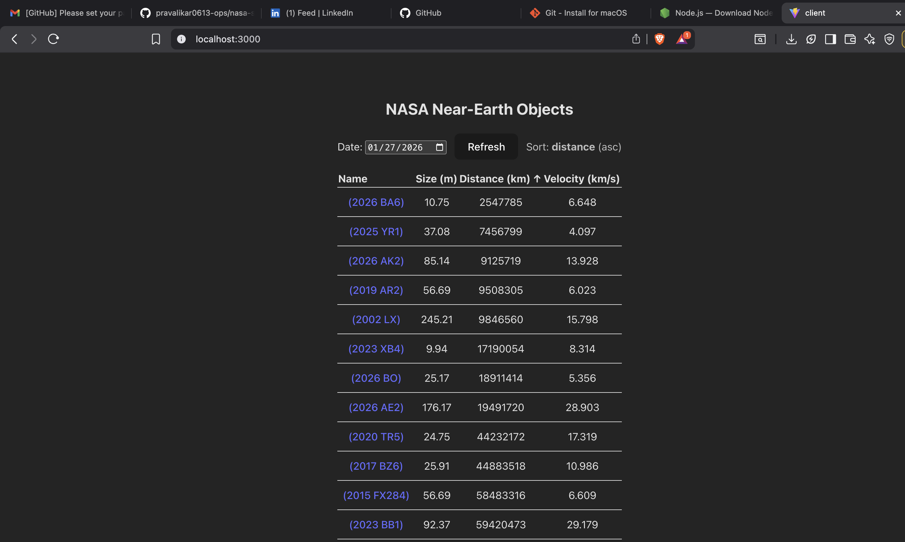

# NASA Near-Earth Objects Space Dashboard

A full-stack web application that visualizes Near-Earth Objects (NEOs) using NASA’s NeoWs (Near Earth Object Web Service).  
The system consists of:

- **Backend:** Node.js + TypeScript + Fastify (API, validation, sorting, caching, Swagger docs)  
- **Frontend:** React + TypeScript + Vite (dashboard UI)

Users can select a date, view asteroid data, and sort results by size, distance, or velocity.

---

## Features

### Backend
- Fetches data from NASA NeoWs API
- Normalizes complex NASA responses
- Server-side sorting
- Input validation with Zod
- In-memory caching
- OpenAPI 3 (Swagger UI)
- CORS enabled

### Frontend
- Date picker
- Sortable table columns
- Clickable asteroid names (NASA JPL links)
- Loading & error states
- Responsive layout

---

## Tech Stack

**Backend**
- Node.js 18+
- TypeScript
- Fastify
- Zod
- Swagger / OpenAPI

**Frontend**
- React 18
- TypeScript
- Vite
- Fetch API

---

## 📂 Project Structure

nasa-space-dashboard/
├─ server/ # Backend
├─ client/ # Frontend
└─ README.md


---

## Prerequisites

- Node.js 18+
- npm
- Git
- (Optional) Postman

---

# Backend Setup

```bash
cd server
npm install

```
- Created .env file
```bash
NASA_API_KEY=DEMO_KEY
PORT=3001
```

- Run backend
```bash 
npm run dev
```

- Backend API runs in 3001 port by default. Test endpoint from the postman collection.

- Server starts at http://localhost:3001

---

# Swagger (Open API)

Interactive documentation:
```bash
http://localhost:3001/docs
```

---

# API Endpoints

## 1. Health Check

GET `/health`  

Used to verify that the server is running.
Response:
```json
{
    "ok": true
}
```

## 2. Get Near Earth Objects

GET `/api/neos`

Returns near earth objects for a specific date with optional sorting. 

### Query Parameters
1. date -> required
2. sort -> not required
3. order -> not required

request: 
```bash
http://localhost:3001/api/neos?date=2026-01-27&sort=size&order=desc
```

Response:

```json
{
    "date": "2026-01-27",
    "count": 17,
    "items": [
        {
            "id": "3744153",
            "name": "(2016 CO247)",
            "sizeMeters": 326.2440628073,
            "missDistanceKm": 63457920.37058149,
            "relativeVelocityKps": 29.4065110631,
            "nasaJplUrl": "https://ssd.jpl.nasa.gov/tools/sbdb_lookup.html#/?sstr=3744153"
        },
        {
            "id": "3127390",
            "name": "(2002 LX)",
            "sizeMeters": 245.21250664345,
            "missDistanceKm": 9846560.466351893,
            "relativeVelocityKps": 15.7978038957,
            "nasaJplUrl": "https://ssd.jpl.nasa.gov/tools/sbdb_lookup.html#/?sstr=3127390"
        },
        {
            "id": "54575762",
            "name": "(2026 AE2)",
            "sizeMeters": 176.17432526534998,
            "missDistanceKm": 19491719.953245297,
            "relativeVelocityKps": 28.9026487479,
            "nasaJplUrl": "https://ssd.jpl.nasa.gov/tools/sbdb_lookup.html#/?sstr=54575762"
        },
        {
            "id": "54339765",
            "name": "(2023 BB1)",
            "sizeMeters": 92.37248281095,
            "missDistanceKm": 59420473.48267922,
            "relativeVelocityKps": 29.1789678308,
            "nasaJplUrl": "https://ssd.jpl.nasa.gov/tools/sbdb_lookup.html#/?sstr=54339765"
        },
        {
            "id": "54575763",
            "name": "(2026 AK2)",
            "sizeMeters": 85.14175871485,
            "missDistanceKm": 9125719.00085568,
            "relativeVelocityKps": 13.9275415659,
            "nasaJplUrl": "https://ssd.jpl.nasa.gov/tools/sbdb_lookup.html#/?sstr=54575763"
        },
        {
            "id": "3715093",
            "name": "(2015 FX284)",
            "sizeMeters": 56.6947202721,
            "missDistanceKm": 58483315.71121148,
            "relativeVelocityKps": 6.6089511848,
            "nasaJplUrl": "https://ssd.jpl.nasa.gov/tools/sbdb_lookup.html#/?sstr=3715093"
        },
        {
            "id": "3837594",
            "name": "(2019 AR2)",
            "sizeMeters": 56.6947202721,
            "missDistanceKm": 9508305.33584616,
            "relativeVelocityKps": 6.0228275371,
            "nasaJplUrl": "https://ssd.jpl.nasa.gov/tools/sbdb_lookup.html#/?sstr=3837594"
        },
        {
            "id": "54568428",
            "name": "(2025 YR1)",
            "sizeMeters": 37.080246866799996,
            "missDistanceKm": 7456798.835145779,
            "relativeVelocityKps": 4.0967680925,
            "nasaJplUrl": "https://ssd.jpl.nasa.gov/tools/sbdb_lookup.html#/?sstr=54568428"
        },
        {
            "id": "54245809",
            "name": "(2022 CF3)",
            "sizeMeters": 35.2811405929,
            "missDistanceKm": 66471473.554537036,
            "relativeVelocityKps": 17.339767084,
            "nasaJplUrl": "https://ssd.jpl.nasa.gov/tools/sbdb_lookup.html#/?sstr=54245809"
        },
        {
            "id": "54402977",
            "name": "(2023 VX2)",
            "sizeMeters": 34.9576811517,
            "missDistanceKm": 71020021.35585728,
            "relativeVelocityKps": 17.8455996993,
            "nasaJplUrl": "https://ssd.jpl.nasa.gov/tools/sbdb_lookup.html#/?sstr=54402977"
        },
        {
            "id": "3791345",
            "name": "(2017 XV60)",
            "sizeMeters": 29.75381215555,
            "missDistanceKm": 67914572.38448964,
            "relativeVelocityKps": 4.1123505543,
            "nasaJplUrl": "https://ssd.jpl.nasa.gov/tools/sbdb_lookup.html#/?sstr=3791345"
        },
        {
            "id": "3767015",
            "name": "(2017 BZ6)",
            "sizeMeters": 25.9144870499,
            "missDistanceKm": 44883518.3248073,
            "relativeVelocityKps": 10.9864747823,
            "nasaJplUrl": "https://ssd.jpl.nasa.gov/tools/sbdb_lookup.html#/?sstr=3767015"
        },
        {
            "id": "54576627",
            "name": "(2026 BO)",
            "sizeMeters": 25.173442901650002,
            "missDistanceKm": 18911413.673905123,
            "relativeVelocityKps": 5.3555480359,
            "nasaJplUrl": "https://ssd.jpl.nasa.gov/tools/sbdb_lookup.html#/?sstr=54576627"
        },
        {
            "id": "54065900",
            "name": "(2020 TR5)",
            "sizeMeters": 24.7481430032,
            "missDistanceKm": 44232172.20574449,
            "relativeVelocityKps": 17.3192012962,
            "nasaJplUrl": "https://ssd.jpl.nasa.gov/tools/sbdb_lookup.html#/?sstr=54065900"
        },
        {
            "id": "3773664",
            "name": "(2017 FW128)",
            "sizeMeters": 14.372840856,
            "missDistanceKm": 66328114.72354453,
            "relativeVelocityKps": 6.668527535,
            "nasaJplUrl": "https://ssd.jpl.nasa.gov/tools/sbdb_lookup.html#/?sstr=3773664"
        },
        {
            "id": "54579254",
            "name": "(2026 BA6)",
            "sizeMeters": 10.74837021685,
            "missDistanceKm": 2547784.987882596,
            "relativeVelocityKps": 6.6478353655,
            "nasaJplUrl": "https://ssd.jpl.nasa.gov/tools/sbdb_lookup.html#/?sstr=54579254"
        },
        {
            "id": "54414584",
            "name": "(2023 XB4)",
            "sizeMeters": 9.94357644425,
            "missDistanceKm": 17190053.620443292,
            "relativeVelocityKps": 8.3139947752,
            "nasaJplUrl": "https://ssd.jpl.nasa.gov/tools/sbdb_lookup.html#/?sstr=54414584"
        }
    ]
}
```

---

# Front end Setup

```bash
cd client
npm i
```
- Run frontend
```bash
npm run dev
```
- Front end UI will run in 3000 port. Test with following endpoint URL: http://localhost:3000



---
# Caching
- In memory Cache
- TTL : 5 minutes
- keyed by date